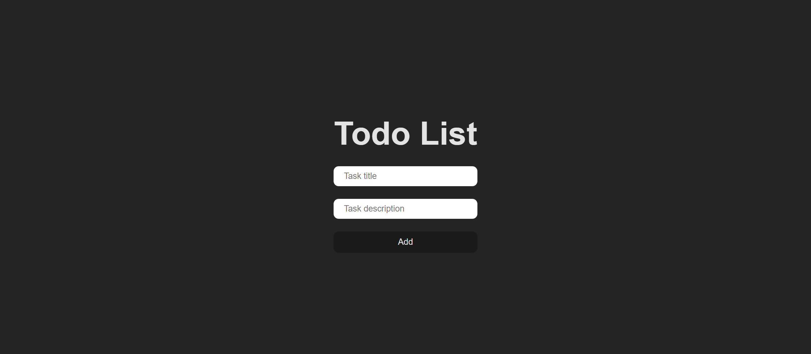
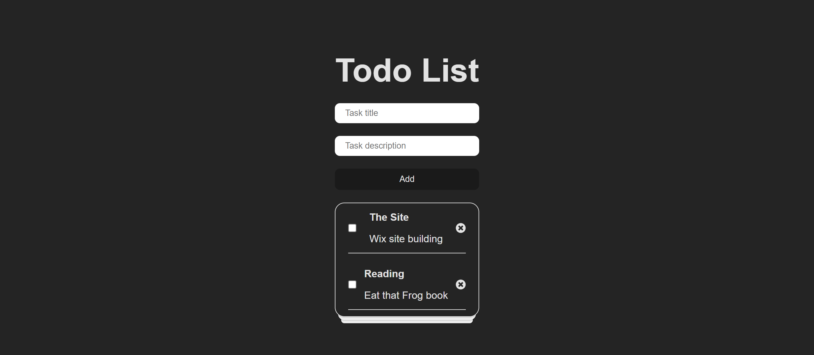
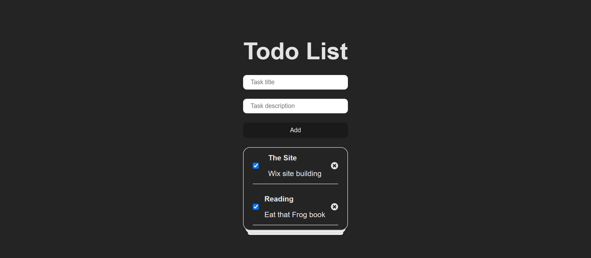

# Todo-App
Dev internship Todo List Assessment

An application used to filter data form Twitter based on user preference, built with React, Redux, JavaScript, and CSS.

## Project Screen Shot(s)

## Installation and Setup Instructions
Clone down this repository. You will need `node` and `npm` installed globally on your machine.  

Clone Repo:

`git clone https://github.com/TRIPLE-ADE/Todo-App`

Installation:

`npm install`  

To Run Test Suite:  

`npm test`  

To Start Server:

`npm run dev`  

To Visit App:

`http://localhost:5173/`  

## Reflection 

This was a 2days long project built for a dev internship assessment. Project goals are listed below:
    - The application should allow users to add, and delete tasks.
    - Tasks should have a title, description, and status (completed or not).
    - The status should be toggleable.
    - Additionally, the application should persist data using LocalStorage.

The technologies implemented in this project are React, React Hooks  and a significant amount of VanillaJS, JSX, and CSS. I chose to use the `vite` boilerplate to minimize 